# Diffy

_A Neural Network Color Learning Experiment (Future Diffusion Model)_

## What It Does Right Now

Diffy is currently a **color name autoencoder** that learns to associate color names with high-dimensional vector representations. It's the foundation for what will become a diffusion model.

### Current Capabilities

- **Color Data Collection**: Scrapes 264 color names and hex values from Wikipedia's "List of colors: A–F" page
- **Neural Network Training**: Autoencoder with leaky ReLU activation and MSE loss
- **Color Learning**: Attempts to learn distinct 128-dimensional representations for each color name
- **Reconstruction Testing**: Shows which colors the network can distinguish vs. which ones it confuses

### Architecture

```mermaid
graph LR
    A["264<br/>Colors"] --> B["128D<br/>██<br/>██<br/>██<br/>██"]

    B --> C["110D<br/>██<br/>██<br/>█"]
    C --> D["83D<br/>██<br/>█"]
    D --> E["70D<br/>█<br/>█"]
    E --> F["56D<br/>█<br/>🔥"]

    F --> G["70D<br/>█<br/>█"]
    G --> H["83D<br/>██<br/>█"]
    H --> I["110D<br/>██<br/>██<br/>█"]
    I --> J["128D<br/>██<br/>██<br/>██<br/>██"]

    J --> K["Color<br/>Match"]

    subgraph "ENCODER🔽"
        B
        C
        D
        E
    end

    subgraph "DECODER🔼"
        G
        H
        I
        J
    end

    style A fill:#74c0fc,stroke:#333,stroke-width:2px
    style B fill:#339af0,stroke:#333,stroke-width:2px
    style C fill:#339af0,stroke:#333,stroke-width:2px
    style D fill:#339af0,stroke:#333,stroke-width:2px
    style E fill:#339af0,stroke:#333,stroke-width:2px
    style F fill:#ff6b6b,stroke:#333,stroke-width:4px,color:#fff
    style G fill:#51cf66,stroke:#333,stroke-width:2px
    style H fill:#51cf66,stroke:#333,stroke-width:2px
    style I fill:#51cf66,stroke:#333,stroke-width:2px
    style J fill:#51cf66,stroke:#333,stroke-width:2px
    style K fill:#ffd43b,stroke:#333,stroke-width:2px
```




**Key Architecture Details:**

- **Input**: Color names (264 colors from Wikipedia)
- **Encoder**: 128D → 3 hidden layers → 56D bottleneck
- **Decoder**: 56D → 3 hidden layers → 128D reconstruction
- **Challenge**: 0.21 dimensions per color in the bottleneck (testing memorization limits!)
- **Activation**: Leaky ReLU (α=0.01) throughout
- **Loss**: Mean Squared Error (MSE)

## Quick Start

1. **Install dependencies**:

   ```bash
   pip install -r requirements.txt
   ```

2. **Scrape color data** (optional - colors_a_f.json already included):

   ```bash
   python scrape_colors.py
   ```

3. **Train the color autoencoder**:
   ```bash
   python main.py
   ```

## Current Experiment Results

The network is attempting to learn 264 different color names with only 56 latent dimensions - that's ~0.2 dimensions per color! This tests the fundamental limits of neural network memorization capacity.

**Hypothesis**: Perfect separation requires ~1 dimension per item, so 56D for 264 colors should be challenging.

## Roadmap

### Phase 1: Multi-modal Autoencoder (Next)

- [ ] Add image encoding (CNN layers)
- [ ] Shared latent space for text+image
- [ ] GPU acceleration
- [ ] Color patch generation

### Phase 2: Diffusion Model (Future)

- [ ] Implement diffusion process
- [ ] Noise scheduling
- [ ] Stable diffusion architecture
- [ ] Text-to-color-image generation

### Phase 3: Full Pipeline (Goal)

- [ ] Text prompt → Color image generation
- [ ] Quality improvements
- [ ] Additional modalities

## Technical Details

- **Framework**: Pure NumPy implementation (no PyTorch/TensorFlow)
- **Architecture**: Autoencoder with leaky ReLU (α=0.01)
- **Training**: MSE loss, gradient clipping, careful hyperparameters
- **Data**: Wikipedia color names + random 128D vectors (testing pure memorization)

## Files

- `main.py` - Main training entry point
- `scrape_colors.py` - Wikipedia color data scraper
- `color_loader.py` - Loads and cleans color names from JSON
- `neuralnet/network.py` - Autoencoder implementation
- `neuralnet/gemini_layer.py` - Neural network layer with leaky ReLU
- `tokenizer/tokenizer.py` - Simple text tokenization
- `colors_a_f.json` - Scraped Wikipedia color data

## Current Status

**Working**: Color name autoencoder, data collection, training pipeline
**In Progress**: Testing memorization capacity with 264 colors  
**Next**: Multi-modal architecture for text + images
**Future**: Full diffusion model implementation

---

_Note: This is an experimental neural network project. The "diffusion" capabilities are planned but not yet implemented. Currently focuses on fundamental color representation learning._
