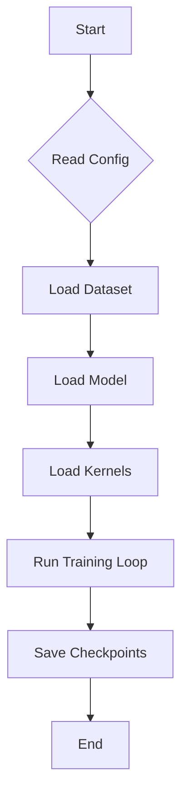
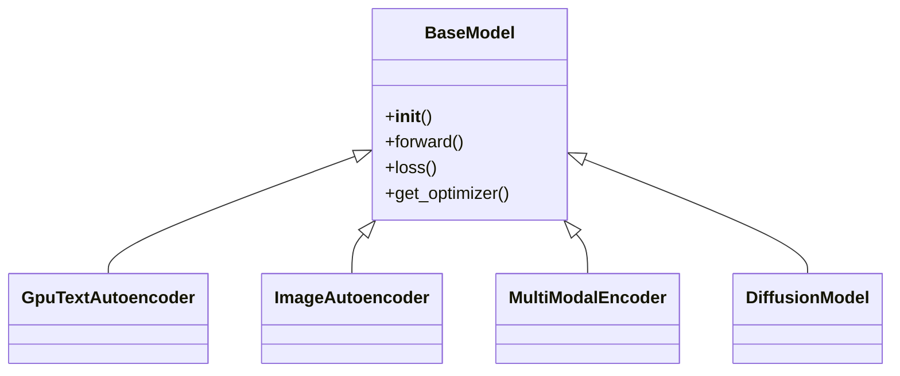
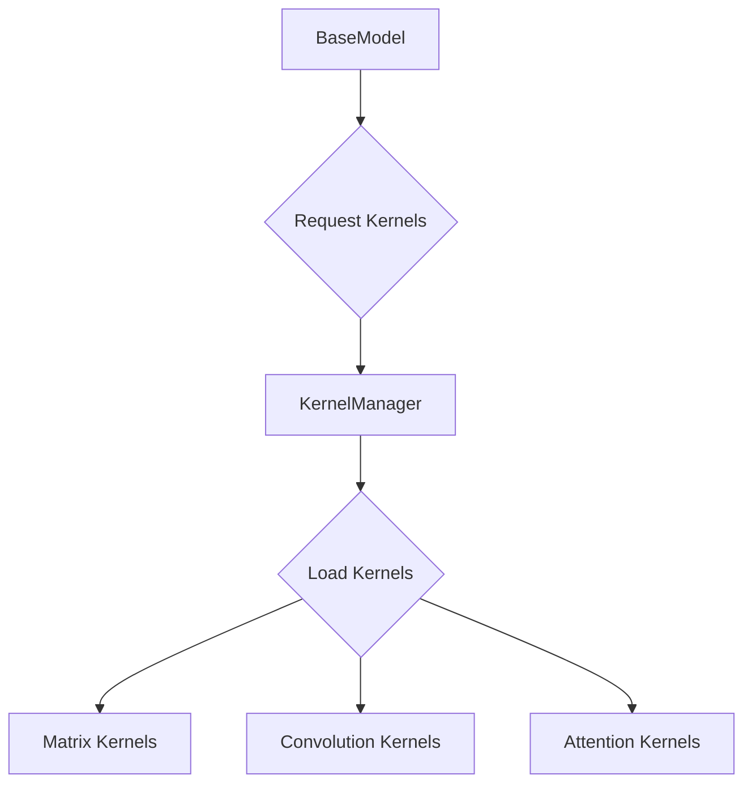
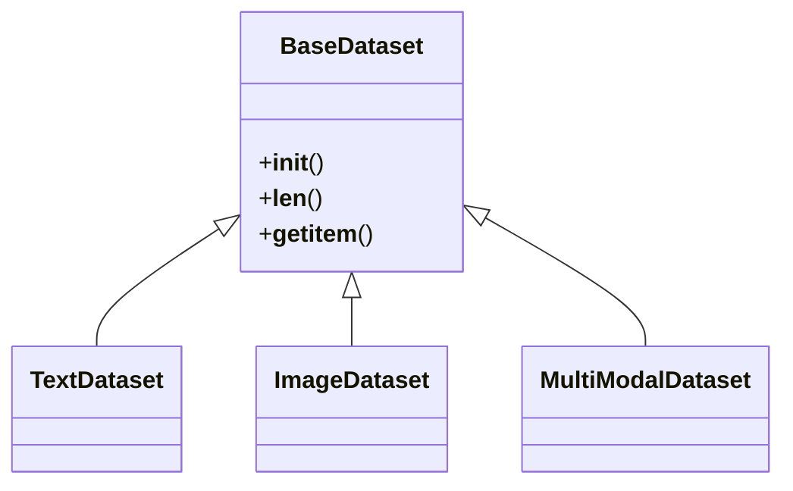
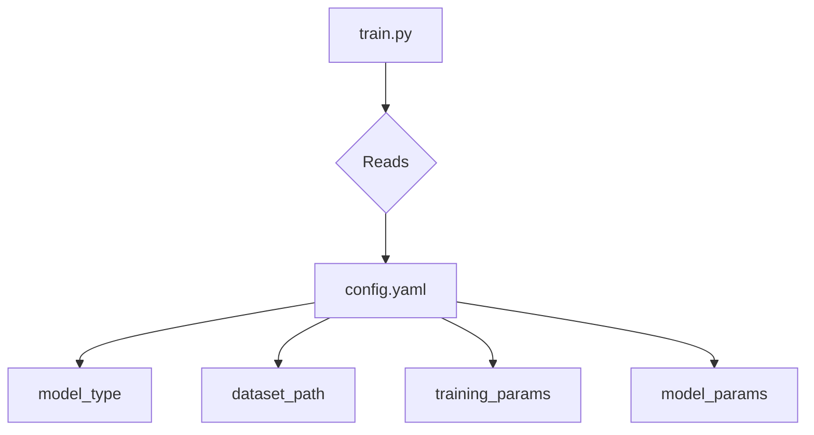

### Plan for Refactoring the NVIDIA Training System

The overall goal is to create a reusable and extensible system for training various models on the GPU, including text encoders, image encoders, multi-modal encoders, and diffusion models. This plan outlines the necessary changes to achieve this.

**1. Create a Unified Training Script:**

*   **Problem:** The current training process is likely initiated by scripts like `parameter_sweep.py`, which are specific to the text autoencoder.
*   **Solution:** Create a single, unified training script (e.g., `train.py`) that can handle different model types and datasets. This script would take configuration files as input to specify the model, dataset, and training parameters.



**2. Introduce a Model Zoo and Base Model Class:**

*   **Problem:** The `gpu_text_autoencoder.py` is a standalone model. A new image autoencoder would be another standalone model, leading to code duplication.
*   **Solution:**
    *   Create a `models` directory within `nvidia/`.
    *   Move `gpu_text_autoencoder.py` into `nvidia/models/`.
    *   Create a `BaseModel` class that defines a common interface for all models (e.g., `__init__`, `forward`, `loss`, `get_optimizer`).
    *   Refactor `GpuTextAutoencoder` to inherit from `BaseModel`.
    *   New models like `ImageAutoencoder` would also inherit from `BaseModel`.



**3. Abstract GPU Kernels:**

*   **Problem:** The `matrix_kernels.py` are likely tightly coupled to the text autoencoder's architecture.
*   **Solution:**
    *   Create a `kernels` directory with subdirectories for different kernel types (e.g., `matrix`, `convolution`, `attention`).
    *   Create a `KernelManager` that loads and provides the appropriate kernels based on the model's needs.
    *   The `BaseModel` will have a method to specify which kernels it requires.



**4. Implement a Flexible Data Loading Pipeline:**

*   **Problem:** The current data loading is likely specific to text data.
*   **Solution:**
    *   Create a `datasets` directory.
    *   Implement a `BaseDataset` class that defines a common interface for all datasets (e.g., `__init__`, `__len__`, `__getitem__`).
    *   Create different dataset loaders for text, images, and multi-modal data, all inheriting from `BaseDataset`.
    *   The unified training script will use the appropriate dataset loader based on the configuration.



**5. Use a Unified Configuration System:**

*   **Problem:** Training parameters are likely scattered across different scripts.
*   **Solution:**
    *   Use a single configuration file format (e.g., YAML or JSON) for all training runs.
    *   The configuration file will specify:
        *   `model_type`: (e.g., `text_autoencoder`, `image_autoencoder`)
        *   `dataset_path`: Path to the training data.
        *   `training_params`: (e.g., learning rate, batch size, epochs)
        *   `model_params`: (e.g., layer sizes, activation functions)



**6. Refactor the Directory Structure:**

To support these changes, the `nvidia/` directory should be reorganized as follows:

```
nvidia/
├── Dockerfile
├── README_DEPLOYMENT.md
├── requirements.txt
├── train.py
├── configs/
│   ├── text_autoencoder.yaml
│   └── image_autoencoder.yaml
├── datasets/
│   ├── __init__.py
│   ├── base_dataset.py
│   ├── text_dataset.py
│   └── image_dataset.py
├── models/
│   ├── __init__.py
│   ├── base_model.py
│   ├── text_autoencoder.py
│   └── image_autoencoder.py
├── kernels/
│   ├── __init__.py
│   ├── kernel_manager.py
│   ├── matrix/
│   │   └── matrix_kernels.py
│   └── convolution/
│       └── conv_kernels.py
└── utils/
    ├── __init__.py
    └── logger.py
```

By implementing this plan, the `nvidia/` directory will be transformed into a flexible and scalable training platform that can easily accommodate new models and datasets with minimal code changes.